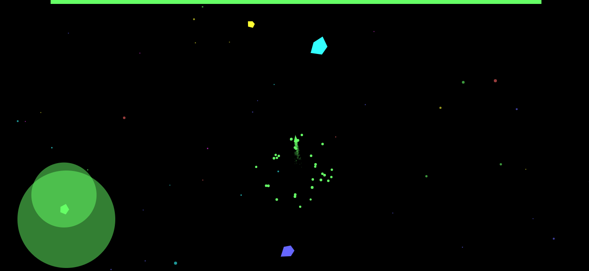
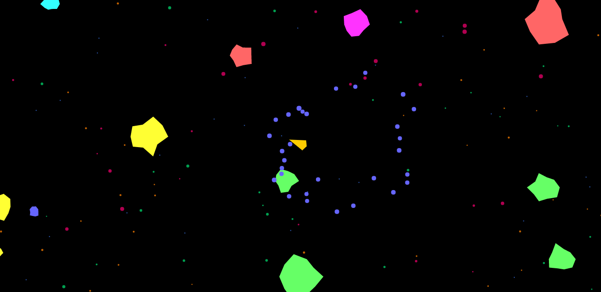
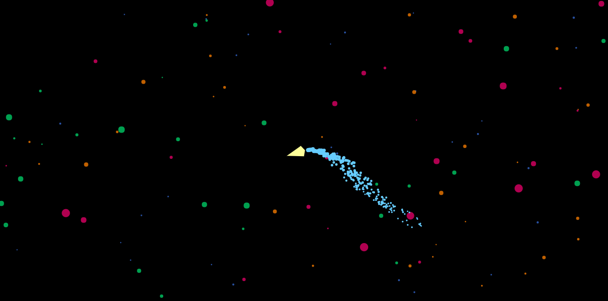

# Game engine
Simple 2D ES6 game engine

# Links
 - [Demo link](https://rawgit.com/ichko/sidescroll/master/index.html)

# Example code
```javascript
import {
    Vector, CanvasRenderer, Scene,
    Engine, SpringyVector, Parallax
} from 'engine';

import { IO } from './io';
import { Player } from './player';
import { AsteroidField } from './asteroid-field';
import { Environment } from './environment';
import { Controller } from './controller';


let init = (canvas) => {

    let [ width, height ] = [ canvas.width, canvas.height ] = [ window.innerWidth, window.innerHeight ];
    let ctx = canvas.getContext('2d');
    ctx.translate(width / 2, height / 2);
    ctx.scale(1, -1);


    let io = new IO(width, height);
    let renderer = new CanvasRenderer(ctx, width, height);
    let scene = new Scene();
    let engine = new Engine(renderer, scene);

    let controller = new Controller(io, width, height);
    let player = new Player(controller);
    let camera = new SpringyVector({
        position: new Vector(0, 50), elasticity: 0.08, damping: 0.3,
        target: () => player.position.copy().add(player.velocity.copy().scale(3))
    });

    let parallax = new Parallax(camera.position);
    let environment = new Environment(camera, width, height);

    io.onMouse(() => player.speed = 5, () => player.speed = 0);
    environment.container.forEach(layer => parallax.addLayer({ depth: layer.depth, objects: layer.objects }));
    parallax.addLayer({ objects: [player, new AsteroidField(player, Math.max(width, height))] });
    scene.add(parallax, controller, camera, environment);


    window.cancelAnimationFrame(animationFrame);
    (function animation() {
        engine.clear().render().update();
        animationFrame = window.requestAnimationFrame(animation);
    })();

};


let animationFrame = undefined,
    canvas = document.getElementById('canvas');

init(canvas);
```

# Screenshots






